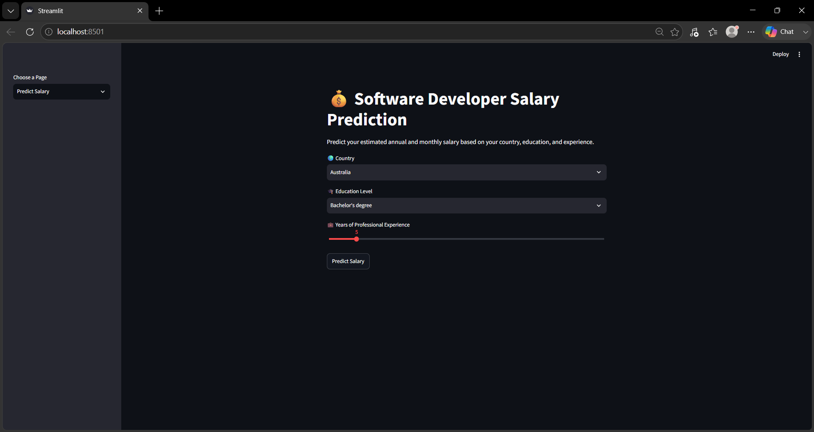
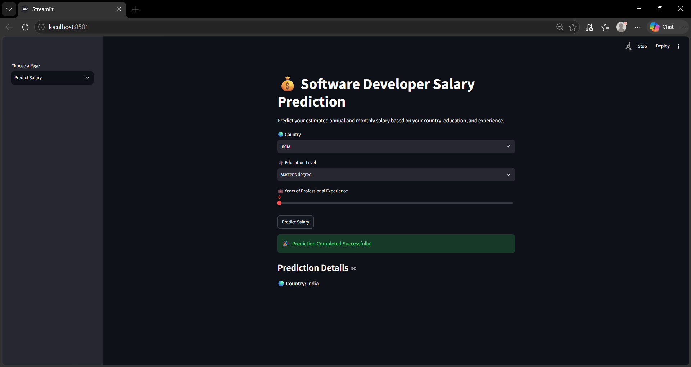
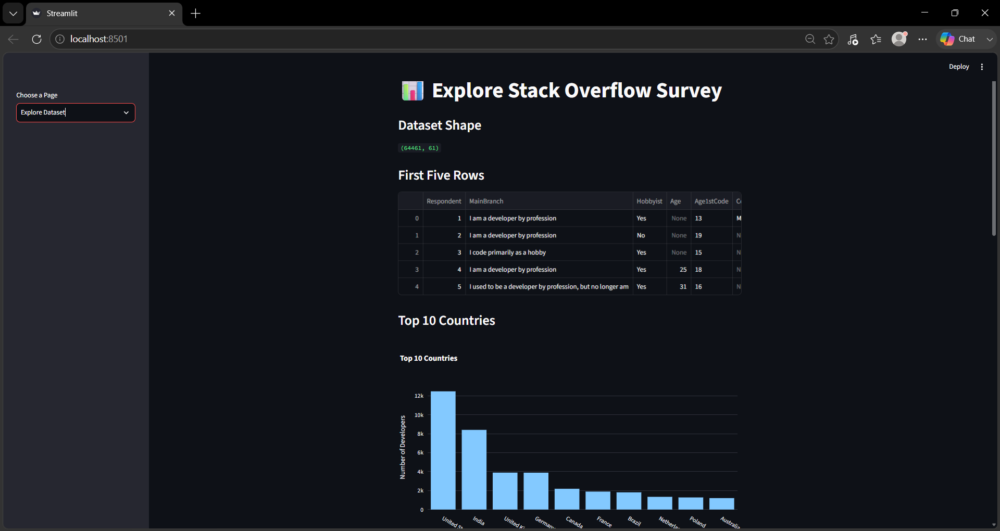
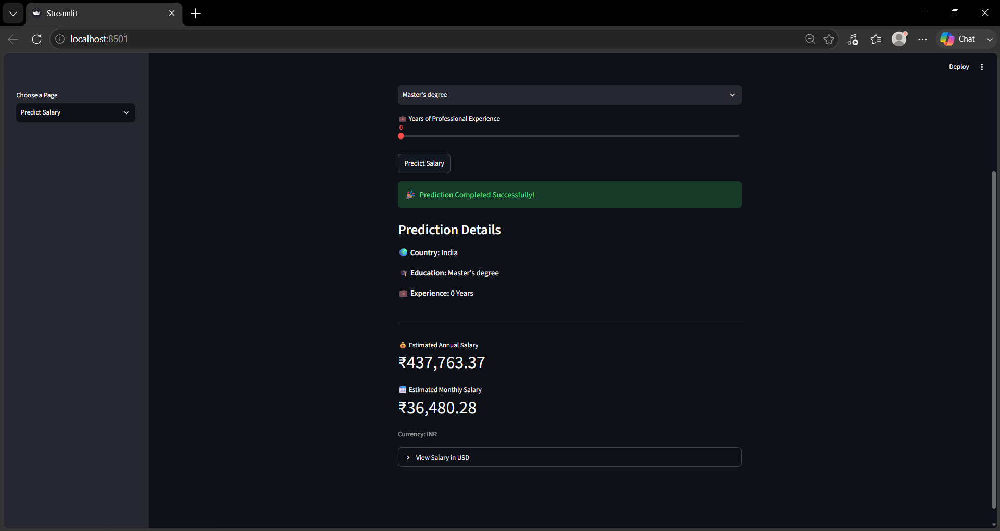

# 💰 Salary Prediction Web Application

A Machine Learning web application that predicts the annual and monthly salary of software developers based on their **Country**, **Education Level**, and **Years of Professional Experience**.

The application is built using **Python**, **Scikit-learn**, and **Streamlit**, and also supports **country-based currency conversion** for salary predictions.

---

## 🚀 Features

- 📊 Explore the Stack Overflow Developer Survey dataset
- 🤖 Predict software developer salaries using Machine Learning
- 🌍 Country-wise salary prediction
- 💱 Automatic currency conversion based on the selected country
- 📅 Display both Annual and Monthly Salary
- 📈 Interactive data visualization using Plotly
- 🎨 Simple and user-friendly Streamlit interface

---

## 🛠️ Tech Stack

- Python
- Pandas
- NumPy
- Scikit-learn
- Streamlit
- Plotly
- Joblib
- Requests
- Git & GitHub

---

## 📂 Project Structure

```text
salaryprediction-webapp/
│
├── app.py
├── train_model.py
├── predict_page.py
├── explore_page.py
├── currency_converter.py
├── requirements.txt
├── README.md
│
├── data/
│   ├── survey_results_public.csv
│   └── survey_results_schema.csv
│
├── model/
│   └── saved_steps.pkl
│
└── images/
```

---

## 📊 Dataset

This project uses the **Stack Overflow Developer Survey 2020** dataset.

Dataset includes information such as:

- Country
- Education Level
- Employment Status
- Years of Professional Experience
- Annual Salary

---

## ⚙️ Installation

### 1. Clone the repository

```bash
git clone https://github.com/mausumi25/salaryprediction-webapp.git
```

### 2. Navigate to the project folder

```bash
cd salaryprediction-webapp
```

### 3. Create a virtual environment

**Windows**

```bash
python -m venv venv
venv\Scripts\activate
```

**Linux / macOS**

```bash
python3 -m venv venv
source venv/bin/activate
```

### 4. Install dependencies

```bash
pip install -r requirements.txt
```

---

## ▶️ Run the Application

Train the model:

```bash
python train_model.py
```

Start the Streamlit application:

```bash
streamlit run app.py
```

---

## 📸 Screenshots

### Home Page



### Salary Prediction



### Explore Dataset



### Prediction Result



---

## 📈 Machine Learning Workflow

- Data Cleaning
- Feature Engineering
- Label Encoding
- Train-Test Split
- Decision Tree Regression
- Model Evaluation
- Model Serialization using Joblib
- Streamlit Deployment

---

## 🌍 Currency Conversion

The application predicts salary and displays it in the selected country's currency.

Examples:

- 🇮🇳 India → ₹ INR
- 🇺🇸 United States → $ USD
- 🇬🇧 United Kingdom → £ GBP
- 🇩🇪 Germany → € EUR
- 🇯🇵 Japan → ¥ JPY

---

## 🔮 Future Improvements

- Support more machine learning models
- Live exchange rates for all countries
- Download salary report as PDF
- Salary comparison between countries
- Dark mode
- User authentication

---

## 👩‍💻 Author

**Mausumi Rautaray**

- GitHub: https://github.com/mausumi25

---

## ⭐ If you like this project

Please consider giving it a ⭐ on GitHub.